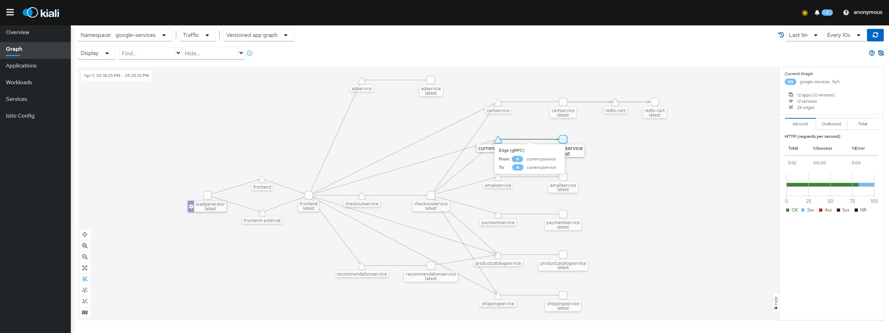
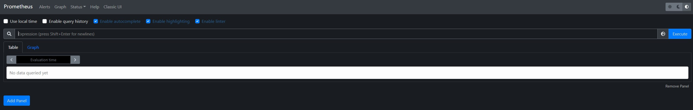
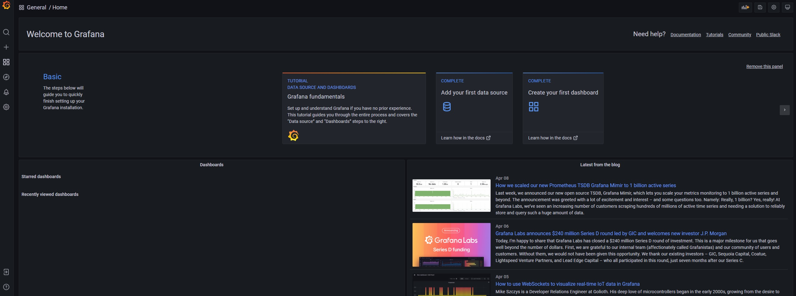

# kubernetes(Kind) + Istio + Kiali + Grafana + Prometheus
 
## Installation Proccess

1.1 We will use Kind to install Kubernetes. 

"kind is a tool for running local Kubernetes clusters using Docker container "nodes". kind was primarily designed for testing Kubernetes itself, but may be used for local development or CI."

Check complete documentation and the steps to install it. ( SUPER EASY ☺️ ) [here](https://github.com/kubernetes-sigs/kind)

- 1.2 - Configure our nodes:

    - 1.2.1 - (Optional) Change you cluster configuration [here](./cluster-config/config.yaml) 
        ```
        kind: Cluster
        apiVersion: kind.x-k8s.io/v1alpha4

        nodes:
        - role: control-plane
        - role: worker
        - role: worker
        ```

    - 1.2.2 - Create a Cluster

        ```
        kind create cluster --config=./cluster-config/config.yaml

        ```
### 2- Istio

 - 2.1 Install Istio

    "Istio is an open platform for providing a uniform way to integrate microservices, manage traffic flow across microservices, enforce policies and aggregate telemetry data. Istio's control plane provides an abstraction layer over the underlying cluster management platform, such as Kubernetes."

    Check the installation proccess here. [here](https://github.com/istio/istio)
 
 - 2.2 Install Istio in Kubernetes

    ```
    istioctl install
    ```

    Result expected:
    ```
    ✔ Istio core installed
    ✔ Istiod installed
    ✔ Ingress gateways installed
    ✔ Installationcomplete 
    
    Making this installation the default for injection and validation.

    Thank you for installing Istio 1.12.  Please take a few minutes to tell us about your install/upgrade experience!  https://forms.gle/FegQbc9UvePd4Z9z7
    ```

### 3- Injected proxy with Istio

To monitoring the services is necessary add the label "istio-injection=enabled" on the namespaces that you want to monitor.

Let's use a google-services namespace as example: 

```sh
kubectl create ns google-services
kubectl label namespace google-services istio-injection=enabled
```
Check if the label was applied

```sh
kubectl get ns google-services --show-labels
```

Install services from google

```sh
kubectl apply -f https://raw.githubusercontent.com/GoogleCloudPlatform/microservices-demo/main/release/kubernetes-manifests.yaml -n google-services
```
### 4- Integrations

Integrations with Kiali
```sh
kubectl apply -f https://raw.githubusercontent.com/istio/istio/release-1.13/samples/addons/kiali.yaml
```

Integrations with Prometheus

```sh
kubectl apply -f https://raw.githubusercontent.com/istio/istio/release-1.13/samples/addons/prometheus.yaml
```

Integrations with Grafana

```sh
kubectl apply -f https://raw.githubusercontent.com/istio/istio/release-1.13/samples/addons/grafana.yaml
```

Check the list of all integrations available [here](https://istio.io/latest/docs/ops/integrations).

### 5- Check created pods

```sh
kubectl get pods -n istio-system
```
### 4- Port foward to access it.

```sh
kubectl get svc -n istio-system
```

```sh
kubectl port-forward svc/kiali -n istio-system 20001 # kiali
kubectl port-forward svc/prometheus -n istio-system 9090 # prometheus
kubectl port-forward svc/grafana -n istio-system 3000 # grafana
```

### 5- Acessing

Kiali


Prometheus


Grafana
